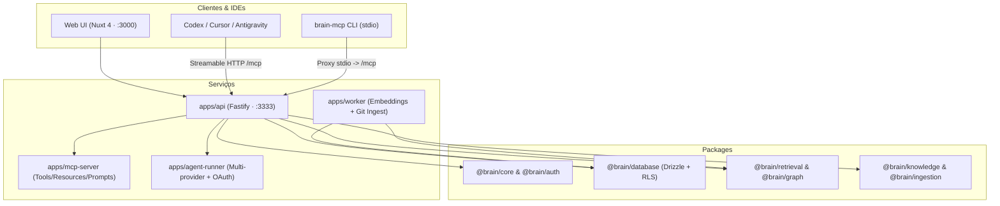

# Topologia do Ecossistema Brain

```mermaid
flowchart TB
  subgraph Clients["Clientes & IDEs"]
    Web["Web UI (Nuxt 4 · :3000)"]
    Codex["Codex / Cursor / Antigravity"]
    CLI["brain-mcp CLI (stdio)"]
  end

  subgraph CoreServices["Serviços"]
    API["apps/api (Fastify · :3333)"]
    MCP["apps/mcp-server (Tools/Resources/Prompts)"]
    Runner["apps/agent-runner (Multi-provider + OAuth)"]
    Worker["apps/worker (Embeddings + Git Ingest)"]
  end

  subgraph DomainPackages["Packages"]
    Core["@brain/core & @brain/auth"]
    DB["@brain/database (Drizzle + RLS)"]
    Retrieval["@brain/retrieval & @brain/graph"]
    Knowledge["@brain/knowledge & @brain/ingestion"]
  end

  Web --> API
  Codex -->|Streamable HTTP /mcp| API
  CLI -->|Proxy stdio -> /mcp| API
  API --> MCP
  API --> Runner
  API --> Core
  API --> DB
  API --> Retrieval
  API --> Knowledge
  Worker --> DB
  Worker --> Retrieval
```
