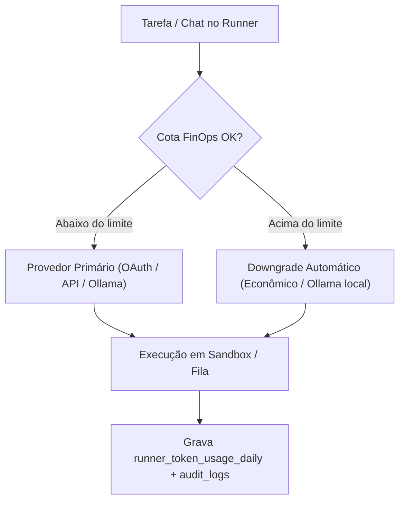

# Execução do Brain Runner & FinOps

```mermaid
flowchart TD
  Req["Tarefa / Chat no Runner"] --> Quota{"Cota FinOps OK?"}
  Quota -->|Abaixo do limite| Primary["Provedor Primário (OAuth / API / Ollama)"]
  Quota -->|Acima do limite| Downgrade["Downgrade Automático (Econômico / Ollama local)"]
  Primary --> Exec["Execução em Sandbox / Fila"]
  Downgrade --> Exec
  Exec --> Usage["Grava runner_token_usage_daily + audit_logs"]
```
