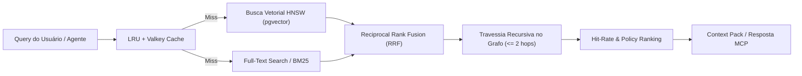

# Pipeline de Busca Híbrida

```mermaid
flowchart LR
  Q["Query do Usuário / Agente"] --> Cache["LRU + Valkey Cache"]
  Cache -->|Miss| Vec["Busca Vetorial HNSW (pgvector)"]
  Cache -->|Miss| FTS["Full-Text Search / BM25"]
  Vec --> RRF["Reciprocal Rank Fusion (RRF)"]
  FTS --> RRF
  RRF --> Graph["Travessia Recursiva no Grafo (<= 2 hops)"]
  Graph --> Boost["Hit-Rate & Policy Ranking"]
  Boost --> Pack["Context Pack / Resposta MCP"]
```
