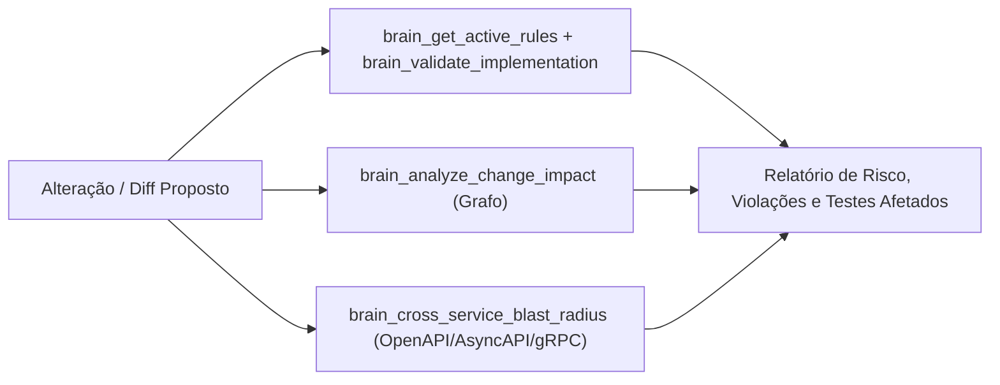

# Pipeline de Impacto & Validação

```mermaid
flowchart LR
  Diff["Alteração / Diff Proposto"] --> Rules["brain_get_active_rules + brain_validate_implementation"]
  Diff --> Graph["brain_analyze_change_impact (Grafo)"]
  Diff --> Contracts["brain_cross_service_blast_radius (OpenAPI/AsyncAPI/gRPC)"]
  Rules --> Report["Relatório de Risco, Violações e Testes Afetados"]
  Graph --> Report
  Contracts --> Report
```
