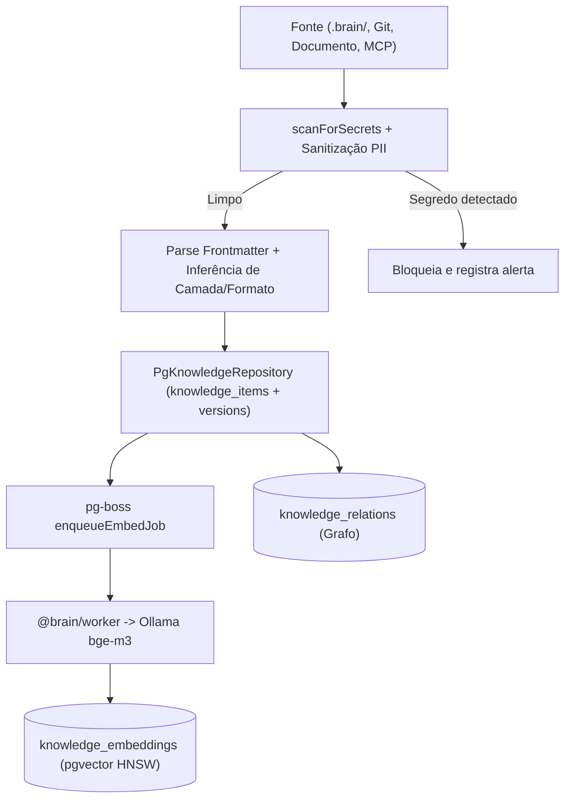

# Pipeline de Ingestão e Indexação

```mermaid
flowchart TD
  Src["Fonte (.brain/, Git, Documento, MCP)"] --> Scan["scanForSecrets + Sanitização PII"]
  Scan -->|Limpo| Parse["Parse Frontmatter + Inferência de Camada/Formato"]
  Scan -->|Segredo detectado| Block["Bloqueia e registra alerta"]
  Parse --> Upsert["PgKnowledgeRepository (knowledge_items + versions)"]
  Upsert --> Queue["pg-boss enqueueEmbedJob"]
  Queue --> Worker["@brain/worker -> Ollama bge-m3"]
  Worker --> Vec[("knowledge_embeddings (pgvector HNSW)")]
  Upsert --> Graph[("knowledge_relations (Grafo)")]
```
