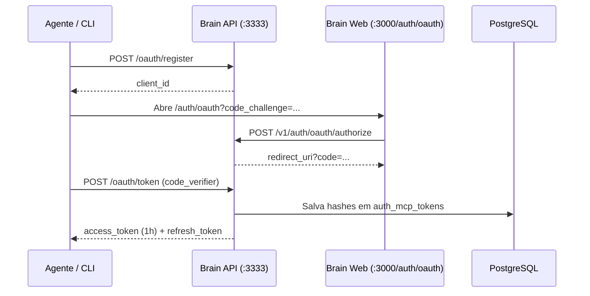

# Fluxo de Autenticação MCP

```mermaid
sequenceDiagram
  participant Agent as Agente / CLI
  participant API as Brain API (:3333)
  participant Web as Brain Web (:3000/auth/oauth)
  participant DB as PostgreSQL
  Agent->>API: POST /oauth/register
  API-->>Agent: client_id
  Agent->>Web: Abre /auth/oauth?code_challenge=...
  Web->>API: POST /v1/auth/oauth/authorize
  API-->>Web: redirect_uri?code=...
  Agent->>API: POST /oauth/token (code_verifier)
  API->>DB: Salva hashes em auth_mcp_tokens
  API-->>Agent: access_token (1h) + refresh_token
```
